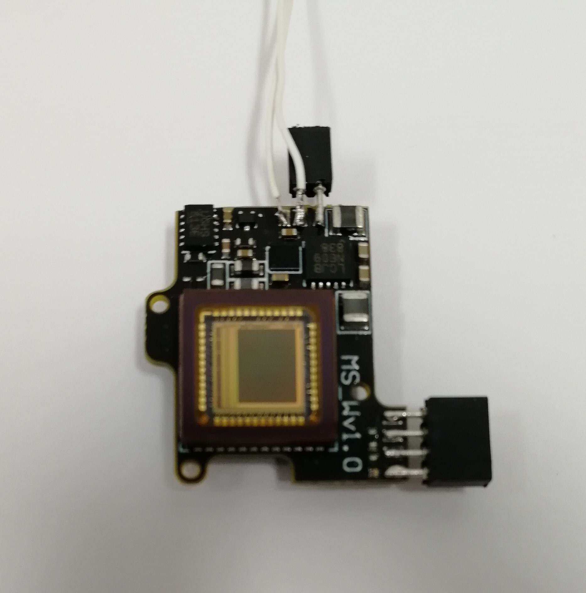
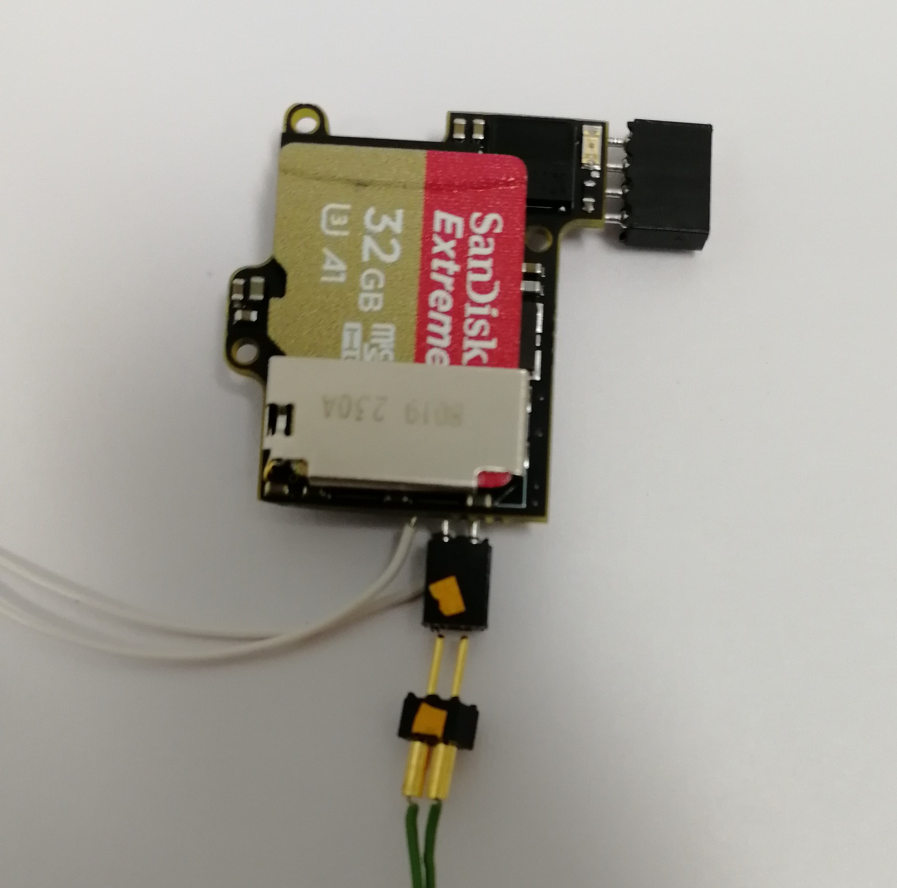
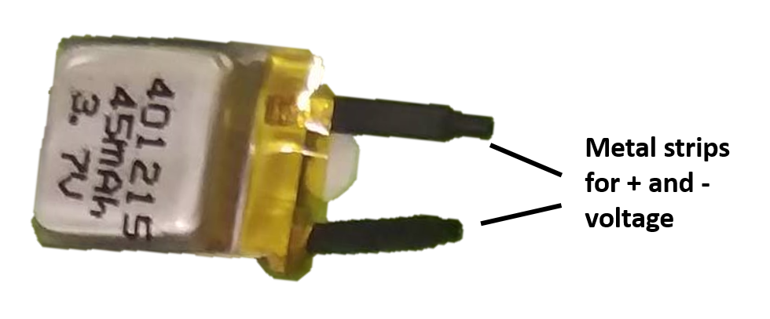
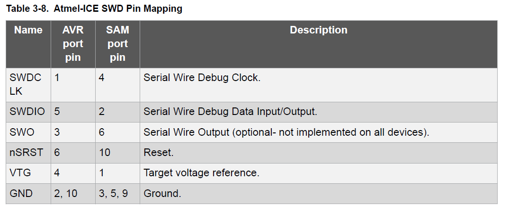
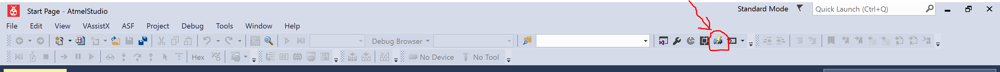
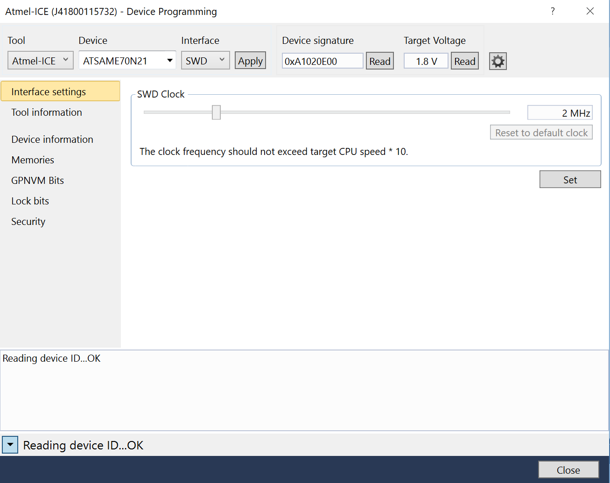
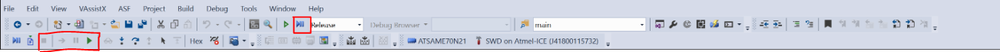
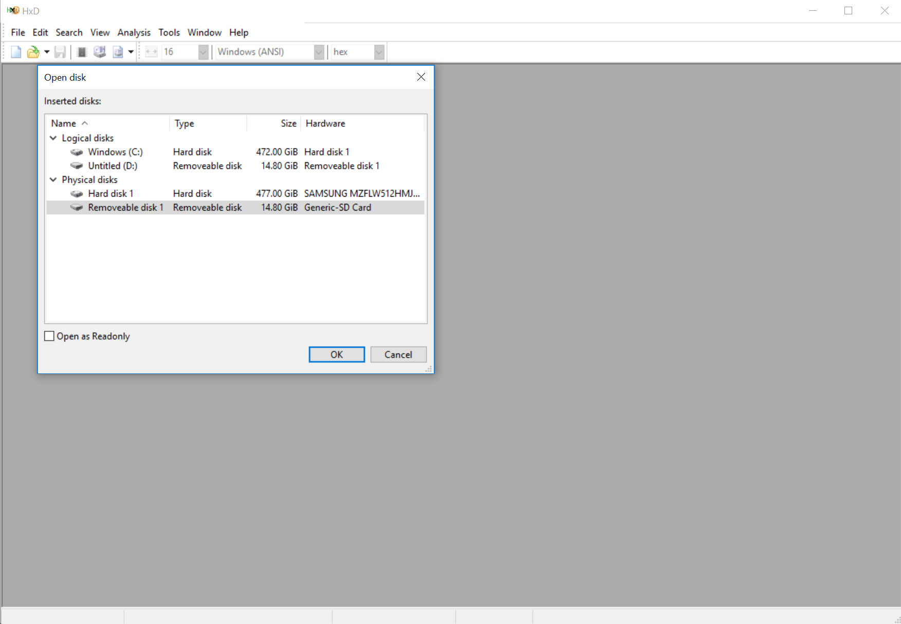
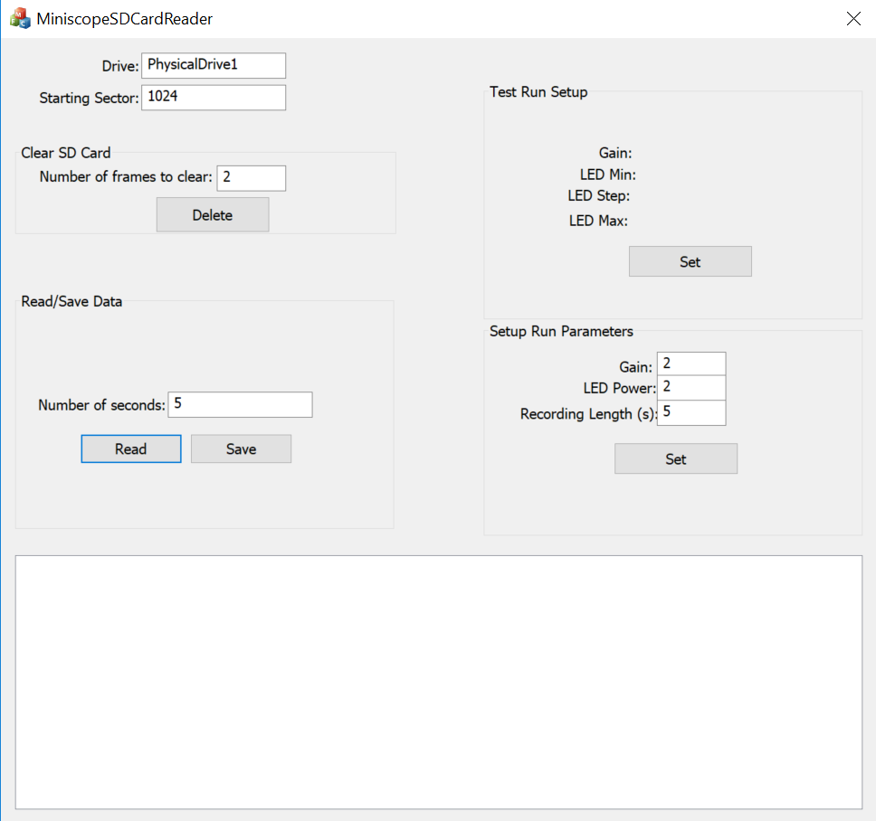
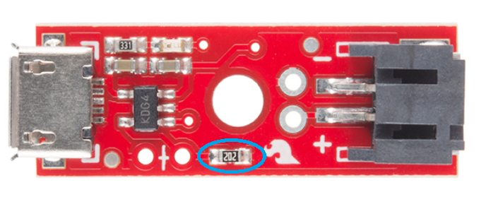

# Information on the wire-free Miniscope

## Tutorial on setting up a new wire-free Miniscope
### 1) First we need to make sure we have all the components and software to get things up and running.
#### New components that need to be made

* Wire-free Miniscope Focus Slider. The wire-free Miniscope using all the same hardware and optics as the standard v3 Miniscope except for the focus slider and CMOS PCB. It also doesn't use the Miniscope DAQ PCB. You can get the wire-free focus slider machined by Shylo or else where and the design file and dimensions are in the "wire-free focus slider" folder. When assembling the Miniscope, if the resistors on the PCB prevents the focus slider from fitting in snugly, you could use a scapel to indent the top of the focus slider.
* Wire-free Miniscope CMOS PCB. You will also need the wire-free CMOS PCB. You can find the fabrication and assembly files in the "wire-free CMOS PCB" folder.

#### Components that need to be bought

* [Atmel ICE](https://www.digikey.com/products/en?mpart=ATATMEL-ICE&v=150) for programming the wire-free PCB
* Micro SD cards. We like to use [these microSD cards](https://www.amazon.com/Sandisk-Extreme-MicroSDHC-UHS-I-SDSDQXL-032G-A46A/dp/B00G5R75AU/ref=sr_1_13?s=electronics&ie=UTF8&qid=1543963603&sr=1-13&keywords=sandisk+micro+sd+card+extreme). The SanDisk microSD extreme cards seem to perform best.
* [Small Lipo battery]( https://www.powerstream.com/ultra-light.htm). The 45mAH batteries seemed to work best and give us about 20 minutes of recording time. You may also want to purchase some batteries to test from wyon,https://www.wyon.ch/en/home.html. We are in the process of testing their W101 and W102 batteries. These might cut out another 0.5 grams if they work well.
* Mill-Max 50mil male and female headers. You can get these from digikey.com and they are used to connect the lipo battery and programmer to the CMOS PCB.
* [Lipo battery charger](https://www.sparkfun.com/products/10217). Most single cell lipo chargers will work. You will need to modify many standard lipo chargers to limit their charging current to what your battery can handle. This is generally done by swapping on a surface mount resistor on the charger PCB.
* [50K Resistor](https://www.digikey.com/product-detail/en/yageo/RC0603FR-0749K9L/311-49.9KHRCT-ND/730212). ~50kOhm 0603 resistors to modify the battery charger.
* [Power source](https://www.amazon.com/Tekpower-TP3016M-Portable-Handheld-Variable/dp/B015OA1J82). This could be helpful when we are programming and testing the PCB.

#### Software to download

* Download [HxD](https://mh-nexus.de/en/hxd/). This software will allow you to directly edit memory blocks of an SD card which will be needed to initially setup an SD card for wire-free Miniscope recording. **NOTE**: This software will allow you to modify any byte of data on any drive connected to your computer so observe particular caution when using it.
* Download [Atmel Studio](https://www.microchip.com/mplab/avr-support/atmel-studio-7). This will be used to program the microcontroller firmware onto the CMOS PCB.
* Download the wire-free Miniscope software found in the "wire-free Miniscope software" folder. This software will allow you to read and save wire-free Miniscope data from an SD card as well as allow you to program recording parameters (exposure, gain, recording length) to the SD card which the Miniscope will read.

### 2) Now we need to get the wire-free CMOS PCB ready to be programmed with the wire-free Miniscope firmware.

#### Soldering the programming header 
* First solder a 4 pin Mill-Max 50mil pitch header to the 4 pad programming interface on the wire-free CMOS PCB. The connections of this programming header are as follows:

      

#### Soldering the lipo battery connector and excitation LED wires
* You can also now solder a 2 pin Mill-Max 50mil pitch header and wires for the excitation LED PCB to the three pads near to top of the board in the above picture. First solder the Mill-Max header to Lipo+ and GND (this will be the connector for the lipo battery). Then solder the 2 LED wires to LED+ and the same middle GND pad that the Mill-Max header is soldered to. The CMOS PCB should now look something like this:

#### Let's also connectorize the Lipo battery
* The lipo battery will come with 2 metal strips (initially protected with heat shrink) extending from the body of the battery which are its + and - voltage terminals. We want to solder a wire to each of these metal strips and then put a 2pin Mill-Max header on the other end of the wires so that the battery can connect to the Mill-Max header we soldered to the Lipo+ and GND pads of the CMOS PCB. 

   * Make sure to never short the 2 metal strips of the lipo battery. If you do, it could damage the battery perminately.
   * Use a multimeter to test which metal strip is the + and which is the - (GND).
   * When soldering wires to the lipo, try to minimize the amount of heat traveling to the lipo battery.

### 3) Programming the wire-free CMOS PCB
#### Connectorizing the Atmel ICE programmer
* In order to program the microcontroller on the CMOS PCB, we first need to wire-up and connectorize a 4pin Mill-Max header to the 4 programming pins of the Atmel ICE programmer. These are GND, VTG, SWDIO, and SWDCLK. Below shows which pins/wires of the Atmel ICE have which function. The Atmel ICE has 2 different 5x2 pin ports. One is labeled AVR and one is labeled SAM. Either will work but depending on which one you are using it will change which column you refer to in the below chart.

* Connect the Atmel ICE to the programming header of the CMOS PCB.
* Power up the CMOS PCB through the lipo connector (2pin Mill-Max head with Lipo+ and GND). You can hook up a charged lipo battery but we suggest using a power supply between 3.5V and 4.2V here. This way you don't have to worry about a battery running out of charge during programming and testing. You can cap the maximum current output of the power source at 0.150A just to be safe. The power source should measure a current of about 0.03A when 3.8V is supplied to the PCB.
* When the CMOS PCB gets powered on, you should see an orange light turn on on the Atmel ICE which shows that the Atmel ICE has detected voltage on the VTG (Voltage Target) pin. In the ATATMEL-ICE-ND, you should see a red light turn on showing that the Atmel box is powered, and a green light showing that the box is measuring a voltage from the PCB. Updating Atmel Studio and restarting the computer could all help with debugging.
* Open Atmel Studio and click the "Device Programming" button

* In the Device Programming window that pops up select:
  * Tool: Atmel ICE
  * Device: ATSAM....  (should automatically be the correct name, ATSAME70N21)
  * Interface: SWD
  * Then click "Apply"
* Now check to make sure that Atmel Studio can communicate with the microcontroller on the CMOS PCB. You do this by clicking the "Read" button under Device Signature. If everything is powered and connected correctly you should see some numbers and letter pop up in the box and no error window show up. Now we are ready to program the microcontroller.

* Click "Memory" on the left menu panel of the Device Programming window we are currently in. If the memory tab is not showing up, make sure to select the tool, device, and interface and click apply again
* Click "Browse" and locate the wire-free Miniscope firmware. This is a .hex file you can find in the "/wire-free-firmware" folder. Either the .hex or .elf file should work.
* Click "Program". This will erase, program, and verify the microcontroller. It will tell you if everything was successful.
* Exit the Device Programming window.
* Now we have to do something a bit weird. I am not sure why this has to be done but it does. Open up the Atmel project found in the "/wire-free-firmware" folder. This load up the code that makes up the wire-free Miniscope firmware. Now click "Debug" from the top menu bar and then click "Start Debugging and Break". Wait about 15 seconds while the debugger does its thing in Atmel Studio and then the code should jump to the "main()" function and highlight it. Now click the play button (labelled "Start Debugging") in the top menu. Wait a few seconds then click the stop button (labelled "Stop Debugging"). 

* Go back to the "Device Programming" window by clicking the "Device Programming" button.
* Repeat the steps to program the PCB with the .hex file.
* Now the microcontroller on the wire-free Miniscope CMOS PCB knows how to be a wire-free Miniscope microcontroller.

### 4) Configure the micro SD card
The wire-free Miniscope and the Miniscope SD Card Reader software are able to read and write raw data directly into and out of the memory blocks of the SD card. In memory block 1023 of the SD card, we need to first write an a key that will, for all subsequnt writing to the SD card, be checked before any raw data writed to make sure we are not writing to the wrong drive. **If we accidently write over a memory block on your computer's drive it can corrupt Windows so we need to be extra careful not to do that.**

#### Add the Write Key to memory block 1023 of the SD Card
Here we will use the HxD software to directly write our Key into the SD Card.
* Open the HxD software and run as Administrator
* Select 'Tools' then select 'Open Disk' from the drop down menu
* Uncheck the 'Open as Readonly' option in the bottom left of the window, select the SD card from the list of disks, and then click 'OK'. If the disk is not showing up, restarting the computer might help.

* **We will now be writing directly to memory blocks of the drive. Make sure you have selected the SD Card and not another drive**
* Go to Sector 1023 and modify the first 16 bytes in this sector.We will be replacing the data in these 16 bytes with the write Key. The write Key is 0x0D7CBA17 repeated 4 times. After replacing these bytes it should look like this:

* Now click 'Save'.
* Let's check to make sure everything was modified and saved correctly. Close HxD, pull out the SD card from the computer and then place it back in the computer. Now open up HxD, open the SD Card disk, go to sector 1023, and check to make sure the write Key is still there. If it is then we have correctly configured the SD Card for wire-free Miniscope recording.

### 5) Using the Miniscope SD Card Reader software
Our final step is to use the Miniscope SD Card Reader software to configure the LED power and Gain of the wire-free Miniscope. The way we do this is by writing the configuration into specific bytes of memory block 1023 of the SD card. The Miniscope SD Card Reader software handles all of this through a simple GUI.
* Open the MiniscopeSDCardReader.exe and run as Administrator

* You may need to change the 'Drive' name based on the naming your computer has given to the SD Card. In the image above it has defaulted to 'PhysicalDrive1' and this name should usually work. If a window pops up asking if you want to format the SD card, do not format it or it will undo what we programmed.
* You can set the Gain, LED Power, and Recording Length. Once the correct numbers have been entered, click 'Set' to write those values to the SD card. The software makes sure the write Key is present in memory block 1023 before attempting to write this configuration. This is used to stop the software from writing to another disk but still be careful. A line should pop up in the bottom window saying “Write key match!”
* After setting the configuration you can take out the SD card from the computer and mount it in the wire-free Miniscope. Once the Miniscope is powered on, it will wait 5 seconds and then begin recording. Always put in the SD card before plugging in the battery.
* After recording with the Miniscope, take the SD card out of the Miniscope mount and place it in your computer. You can now use the MiniscopeSDCardReader software to view, save, and delete recordings.

### 6) Modifying the Lipo charger
In general any single cell lipo charger will work for charging the batteries used for the wire-free Miniscope but you have to make sure that the max current the charge can output is limited to around 20mA. The Sparkfun Lipo charger listed at the top of this tutorial is capped at 500mA by default so we will need to modify the charger to limit the current to ~20mA. The way we do this is by replacing the SMD resistor circled in blue below with a ~50kOhm 0603 resistor. If you don't have a ~50kohn resistor on hand you can [order one from digikey](https://www.digikey.com/product-detail/en/yageo/RC0603FR-0749K9L/311-49.9KHRCT-ND/730212).

You will also need to modify or swap out the lipo connector on the right of the board with connector that can mate to the connector you put on your lipo batteries. 
